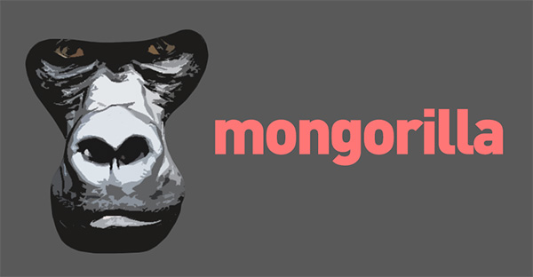

# What is it?
Mongorilla is a simple CMS / Content Management System for MongoDB. But WAIT! it's something different than you have ever seen in other CMSs.

## What makes it different?
Mongoorilla will store your data *as it is* directly in your Mongo database.
What that means? ... No extra metadata, no complex structures, just the data with the structure you want.
You only need to define a document structure/schema in a JSON config file, and Mongorilla will render the interface to CRUD rich documents in a simple fashion.

## Advantages
* Mongorilla is written in well known technologies, NodeJS in the backend and Backbone and more in the front.
* The core functionality is quite simple, all the hard work rely on proved libraries such as Backbone-Forms, Mongoose and many others.
* Mongorilla supports multidimentional documents and ObjectId references.
* Mongorilla supports File/Image uploads against the same MongoDB using GridFS.
* Mongorilla supports rich text editors, Aloha comes out of the box.
* Mongorilla supports revisioning - rolling back document revisions is very easy!
* Setup is just to complete a JSON file under the config folder.
* Customize Mongorilla from the source code is not as terrible as other CMSs, even for tweaking forms, you can create your own editors.

## Limitations
* This CMS is not intended to be public faced. It's just for trusted Content Managers, at least by now and for security reasons.
* Mongorilla per its philosophy, doesn't store revisions information or any other metadata in the database.
* Mongorilla is good for managing static content only.  For collections that are managed by your own application and they have a specific business logic, then Mongorilla isn't your solution.

# Architecture
The core application is based on NodeJS Express.  It has a RESTful API with a unique endpoint which handles all the collections/documents.
There's also a web interface and a JS endpoint for retrieve generated (runtime) javascript files such as Backbone Forms definitions and Backbone Model definitions.

# Live Example
This example site contains exactly the same source as this repository has.  We only pushed to heroku and set up the $MONGORILLA_MONGO_URL env var.
The database on this example is stored in MongoHQ and there's no restriction on what you can edit through Mongorilla, so please, be a good person :).

http://mongorilla.herokuapp.com/
credentials: test / 123

# Roadmap
* Improve documentation, create "How to start", etc.
* Add support for user or role based permissions.
* Enhance the UI, visually and informationally,such as showing the dates better, etc.
* To tune Aloha or replace it by another lightweight Rich Text editor - it's really heavy and slows down the experience.

